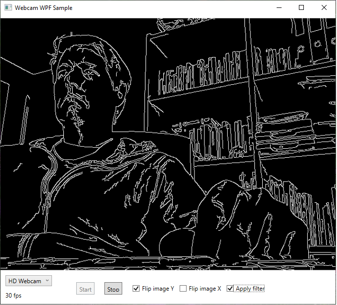

# Webcam WPF Sample
Simple sample to use webcam device with OpenCVSharp4 in .NET 5.0 WPF application. Works with most webcams and also with Basler cameras if you enable DirectShow support in Pylon software.

## Features
* Allows flipping of image in X/Y
* Allows applying a filter to the image. This is meant as a sample to later inject here more advance Computer Vision code or Machine Learning object detection.
* You can adjust Maximum Display Frame Rate with MaxDisplayFrameRate constant.
* Keeps Memory and CPU usage as low as possible to the best combination I could find after testing many different ways. Recommendation are always welcome to improve the code! Contact me in [Twitter](https://twitter.com/GerardoLijs) or PR. Working with Mat and converting to BitmapSource (using OpenCVSharp extension methods) in the UI Thread was the winner so far. Tried also BitmapImage with StreamSource and MemoryStream, Freeze bitmap, etc.
* Works fine with Basler Camera providing images at 200fps

## Notes
* Based on code by Franceso Bonizzi [GitHub](https://github.com/FrancescoBonizzi/WebcamControl-WPF-With-OpenCV)